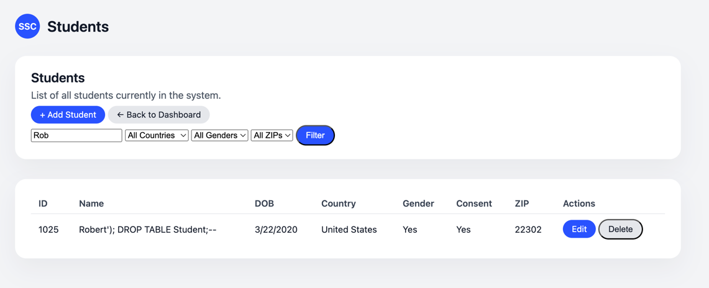

# Student Support Database

## Overview 
The Student Support Center is a small Flask web application backed by a SQLite database.
It helps track students, counseling visits, issues, referrals, follow-ups, diagnoses, and courses in one place.

---
## Tech Stack
- Backend: Python, Flask, SQLite3
- Templating: Jinja2 (Flask templates)
- Frontend: HTML5, CSS
- Database: `student_support_center.db` built from `create.sql` + `insert.sql`

---
## Set up

Steps to set up an environment 
1. Set up/Activate virtual environment
2. Install requirements
3. Run Flask App


### 1: Set up/Activate


**Set Up Environment (macOS)**
```shell
python3 -m venv db-project
source db-project/bin/activate
pip install --upgrade pip
```

**Set Up Virtual Environment (Windows: PowerShell)**

```shell
py -3 -m venv db-project
.\db-project\Scripts\Activate.ps1
python -m pip install --upgrade pip
```

### 2: Install Requirements

Now that your Environment is up and running, you can install all of your requirements. They live 
in the `requirements.txt` file. Install all of them by running:
```shell
pip install -r requirements.txt
```
### 3: Run Flask App
```shell
flask run
```

### Test Flask App
URL to test Flask App: http://127.0.0.1:5000/ will display. 

---

### Database Setup
We are using sqllite. We will build and populate the database using the `create.sql` and `insert.sql` files.

**Steps to build:**

1. Build
```shell
sqlite3 student_support_center.db < create.sql
```
2. Populate
```shell
 sqlite3 student_support_center.db < insert.sql
```

3. Shell into database to run queries
```shell
sqlite3 student_support_center.db
```

4. Test queries
```shell 
sqlite> SELECT COUNT(*) FROM Student;
sqlite> SELECT COUNT(*) FROM Issue_Type;
sqlite> SELECT COUNT(*) FROM Visit_Counselor;
```

5. Delete Database
```shell
rm student_support_center.db
```
---
## Application Features

### 1. Dashboard (`/`)
- Shows total number of students (from `Student` table).
- Links to:
  - Students
  - Counselors
  - Visits & Issues
  - Referrals & Follow-ups
  - Reports & Analytics
  - SQL Console (read-only)

### 2. Students (`/students`, `/students/<id>`)
- List, search, and filter students by:
  - name, country_of_birth, gender, zip_code
- Add new student via form (`/students/new`).
- View and edit a single student:
  - Basic demographics
  - Visits and issues
  - Diagnoses and symptoms
  - Courses the student is enrolled in
- Delete student with a POST form (`/students/<id>/delete`).

### 3. Counselors (`/counselors`, `/counselor/<id>`)
- Filter counselors by:
  - paid vs volunteer, education, experience, salary
- Add new counselor (`/counselors/new`) and optional salary.
- Counselor detail page shows:
  - Students they’ve seen
  - All their visits
  - Open and completed follow-ups
  - Referrals, financial issues, and coursework issues assigned to them


### 4. Visits & Issues (`/visits`, `/visits/new`, `/visits/<id>`, `/issues/<id>/edit`)
- Filter visits by:
  - students, mode, issue count, critical flag.
- Create new visit (`/visits/new`) with:
  - student, date, mode
  - multiple counselors
  - issues with severity, categories, and types (Referral / Financial / Coursework)
  - suggestions per counselor
  - assign head counselor for critical issues.
- View visit details:
  - counselors
  - issues, categories, types
  - referrals + suggestions
- Edit visits and issues via forms.

### 5. Referrals & Follow-ups (`/referrals`)
- Combined page showing:
  - All referrals with student, details, dates.
  - All follow-ups with student, counselor, date, notes, status.

### 6. SQL Console (`/sql`)
- Textarea to run **read-only** SQL (only `SELECT` allowed).
- Backend enforces:
  - query must start with `SELECT`
  - any other statement returns an error message.
- Results rendered in a HTML table using Jinja2.

### 7. Reports & Analytics (`/reports`, `/reports/<id>`)
- `/reports` lists reports corresponding to queries in `queries.sql`. This is an attempt to address the assignment's 
requirements.
- `/reports/<id>` runs a specific SQL query and displays results corresponding to one of the assignment's requirements.
- Example reports:
  - 3: Students by country of birth
  - 5: Visit frequency by student
  - 6: Number of students per counselor
  - 7: Number of students per issue category
  - 9: Students with critical issues
  - 15: Students who reported a specific keyword (with search box)

---

## Security Considerations

In the Flask app:

- All custom queries in forms use **parameterized SQL** (`?` placeholders) to prevent injection style attacks.
- The SQL Console **blocks non-SELECT queries** by checking that the query starts with `SELECT`.
- Destructive actions like `DROP TABLE` are not allowed through the UI.

---
## Test Queries 
All the queries can be found in the `queries.sql` file. These can be tested using `sql console` feature on the web application.
- 1 - 17 will directly respond to the requirements of the project. 
- 18 - 20 are for security purposes. 


Example of a failed SQL injection query:

